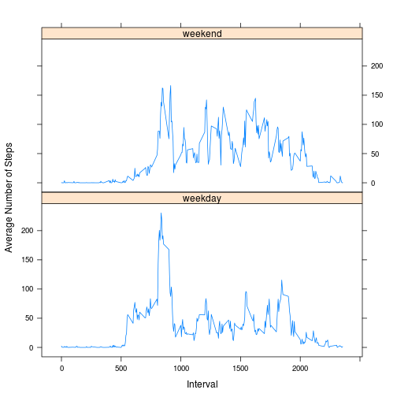

### Introduction
This document presents the results of peer assessments 1 of course Reproducible Research on coursera. This assignment makes use of data from a personal activity monitoring device. This device collects data at 5 minute intervals through out the day. 
The data consists of two months of data from an anonymous individual collected during the months of October and November, 2012 and include the number of steps taken in 5 minute intervals each day.  

First, we set echo equal a TRUE as global options for this assignment.


```r
library(knitr)
opts_chunk$set(echo = TRUE)
```


## Loading and preprocessing the data


```r
# Unzip the data file and read it from current work directory
data <- read.table(unz("activity.zip", "activity.csv"), header=T, quote="\"", sep=",")

# convert date to date data type
data$date <- as.Date(data$date)
```

## What is mean total number of steps taken per day?

Create a new dataset ignoring missing data NA

```r
data_complete <- na.omit(data) 
daily_steps <- rowsum(data_complete$steps, format(data_complete$date, '%Y-%m-%d')) # sum steps by date
daily_steps <- data.frame(daily_steps) 
names(daily_steps) <- ("steps")
```

Plot a histogram of the total number of steps taken each day

```r
hist(daily_steps$steps, 
     main="Total number of steps per day",
     breaks= 10,
     col= "blue",
     xlab="Total Number of Steps per day")
```

 

Report mean and median of steps

```r
mean(daily_steps$steps)
```

```
## [1] 10766.19
```

```r
median(daily_steps$steps)
```

```
## [1] 10765
```

## What is the average daily activity pattern?

Calculate average steps for each of 5-minute interval during a 24-hour period and save them in a data frame called steps


```r
library(plyr)
steps_mean <- ddply(data_complete,~interval, summarise, mean=mean(steps))
```

Plot time series of the 5-minute interval and the average number of steps taken, averaged across all days

```r
library(ggplot2)
qplot(x=interval, y=mean, data = steps_mean,  geom = "line",
      xlab="5-Minute Interval (military time)",
      ylab="Number of Step Count"
      )
```

 

Which 5-minute interval, on average across all the days in the dataset, contains the maximum number of steps?

```r
steps_mean[which.max(steps_mean$mean), ]
```

```
##     interval     mean
## 104      835 206.1698
```

## Imputing missing values

Calculate and report the total number of missing values in the dataset

```r
missing_vals <- sum(is.na(data$steps))
```

Create a new dataset that is equal to the original dataset but with the missing data filled in with mean instead of the missing value


```r
library(dplyr)
```


```r
# Merge the original data with the average by interval data
data_new <- data %>% left_join(steps_mean, by = "interval")

# Create a new column replacing the missing data with the average
data_new$fill <- ifelse(is.na(data_new$steps), data_new$mean, data_new$steps)

# Remove steps $ mean columns then rename the fillSteps column as steps
data_new$steps <- NULL
data_new$mean <- NULL
colnames(data_new) <- c("date", "interval", "steps")

#Rearrange the columns
data_new <- data_new[, c(3, 1, 2)]
head(data_new)
```

```
##       steps       date interval
## 1 1.7169811 2012-10-01        0
## 2 0.3396226 2012-10-01        5
## 3 0.1320755 2012-10-01       10
## 4 0.1509434 2012-10-01       15
## 5 0.0754717 2012-10-01       20
## 6 2.0943396 2012-10-01       25
```

histogram of the total number of steps taken each day and Calculate and report the mean and median total number of steps taken per day

```r
steps_per_day <- aggregate(steps ~ date, data_new, sum)
colnames(steps_per_day) <- c("date","steps")

hist(steps_per_day$steps, 
     main="Total number of Steps per Day with NA values filled",
     breaks= 10,
     col= "green",
     xlab= "Total number of Steps per Day")
```

 

Calculate and report the mean and median total number of steps taken per day

```r
mean(steps_per_day$steps)
```

```
## [1] 10766.19
```

```r
median(steps_per_day$steps)
```

```
## [1] 10766.19
```

Observation:  The mean is the same in both cases(with and without NA values removed) and there is slightly increase in the median in case of NA values removed dataset and the frequency of the second histogram.

Conclusion:  The impact of imputing missing values has increase the peak, but it doesn't affect negatively our predictions.

## Are there differences in activity patterns between weekdays and weekends?

Create a new factor variable in the dataset with two levels – “weekday” and “weekend” indicating whether a given date is a weekday or weekend day.

```r
data_new$DayType <- as.factor(ifelse(weekdays(data_new$date) %in% c("Saturday", "Sunday"), 
    "weekend", "weekday"))
steps_mean2 <- data_new %>% group_by(interval, DayType) %>% summarise(steps = mean(steps, na.rm = TRUE))
head(steps_mean2)
```

```
## Source: local data frame [6 x 3]
## Groups: interval
## 
##   interval DayType      steps
## 1        0 weekday 2.25115304
## 2        0 weekend 0.21462264
## 3        5 weekday 0.44528302
## 4        5 weekend 0.04245283
## 5       10 weekday 0.17316562
## 6       10 weekend 0.01650943
```

Make a panel plot containing a time series plot of the 5-minute interval (x-axis) and the average number of steps taken, averaged across all weekday days or weekend days (y-axis).

```r
library("lattice")
p <- xyplot(steps ~ interval | factor(DayType), data= steps_mean2, 
       type = 'l',
       main="",
       xlab="Interval",
       ylab="Average Number of Steps")
print(p)
```

 

Conclusion:  The plot indicates that the person tends to be more active during the weekend days.


